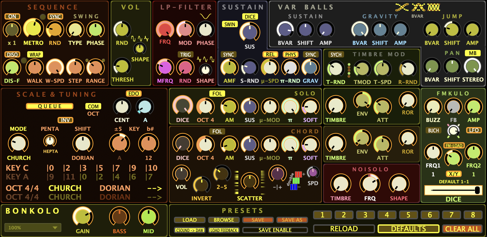
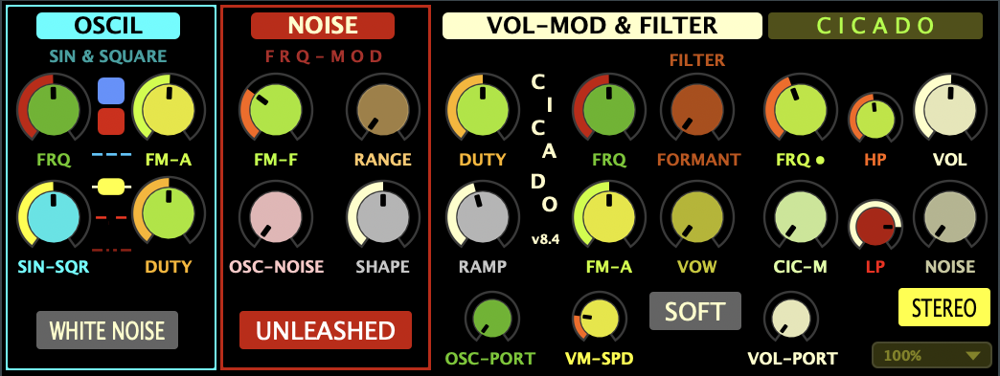

# Csound Instrument Portfolio
*by Samo Lasič*

This portfolio documents a growing collection of real-time performance instruments built in [Csound](https://csound.com/) and [Cabbage](https://cabbageaudio.com/). Each instrument is designed for expressive, gesture-driven control via MIDI controllers, foot pedals, and OSC interfaces—optimized for live performance, ensemble integration, and responsive interaction.

All instruments function as VST/AU plugins and are operated entirely through external hardware or touch-based systems such as Open Stage Control. Designed for hands-on use rather than screen-based editing, they support microtonal tuning, layered modulation, and stereophonic output. Every parameter is mapped for responsive real-time articulation in improvisational contexts.

These instruments are used in live performance and are not publicly released as code. Instead, this site provides detailed overviews of their capabilities and expressive control logic. They reflect a personal and evolving approach to instrument design, shaped through ongoing improvisational practice. The instruments documented here are among the most recent in an ongoing series, developed and refined over the past few years.

## Instruments

- [Tokolo](#tokolo)
- [Bonkolo](#bonkolo)
- [Cicado](#cicado)

---
## Tokolo

**Tokolo** is a modular, polyphonic performance instrument developed in [Csound](https://csound.com/) and [Cabbage](https://cabbageaudio.com/), designed for expressive real-time improvisation. It runs as a plugin (VST/AU) within any DAW and supports dynamic tuning, acoustic-inspired articulation types, and modular per-note modulation. Control is entirely hands-on via MIDI controllers, foot pedals, or OSC-based tools, with no reliance on mouse interaction during performance.

The tuning system is based on **Erv Wilson’s Combination Product Sets (CPS)**, with selectable **Eikosany** scales and real-time modulation of their subsets—**Decanies** and **Hexanies**. **Church modes** in both **Just Intonation** and **Equal Division of the Octave (EDO)** provide additional modal frameworks. Tuning data is precomputed in Python and loaded as frequency tables. A compound indexing system combines mode, key, and note selection for efficient retrieval.

Tokolo’s FM engine uses a fixed carrier-plus-two-modulator topology. **COLOR**, **AMP**, and **FB** control depth and feedback between modulators; ratios are set via sliders or toggled between discrete and continuous values. FM presets offer a broad timbral range.

Articulation types shape envelope, velocity, and aftertouch response. **TOUCH** allows pressure-sensitive phrasing, **BLOW** adds inertia and continuous shaping, and **HAMMER** responds to key velocity and pedal damping. Modes support both polyphonic and portamento play.

The instrument supports per-note modulation of **pitch**, **FM depth (color)**, **volume**, and **pan**, shaped using waveform-based envelopes and random generators. A global lowpass filter follows all voice-level processing.

  
   
  <em>
    <strong>Tokolo interface</strong>, organized by functional groups: Genotype (mode and key selection), Mutate (response to tuning), Eikosany (scale selection), Pitch Modulation & Tuning, Phenotype (articulation type), Gelation (sustained evolving layer), Color Modulation (timbre), FM Synthesis, Lowpass Filter, and Volume & Pan modulation. Key parameters are mapped to MIDI/OSC controllers.</em>

### Articulation Types (Phenotype)

Articulation types determine how notes are initiated, shaped, and sustained. Each mode alters envelope response, velocity sensitivity, and aftertouch behavior:

- **TOUCH** – short, non-sustained envelope with aftertouch-controlled volume
- **BLOW** – airflow-like onset with inertia, continuous aftertouch, and adjustable sustain
- **HAMMER** – velocity-controlled attack with pedal-defined damping, piano-like phrasing

All articulation types support **portamento** via the **PORT** toggle.

### Tuning and Mutate Modes

Tokolo supports dynamic tuning changes, structured around Eikosany (20-tone) scales and their subsets. During performance, players typically switch between **Hexanies** (6-tone) within a **Decany** (10-tone). Additional **Church modes** are accessed via the same interface.

**Mutate modes** define how active notes respond to tuning changes:

- **FIRE** – active notes change pitch immediately
- **LOAD ALL** – all update together after the next note
- **LOAD 1** – new notes use the new tuning; old ones remain
- **DAMP** – sounding notes are released when tuning changes

**Additional Tuning Controls:**  
Global tuning adjustments are made via the **TUNE** slider, which supports fine resolution (µ-tuning) and includes a reset option. An additional **OCTAVE** control enables full-range transposition using MIDI input, designed for seamless access alongside other performance gestures.

**Harmonization:**  
The **HARM** and **b#** controls enable probabilistic harmonization. As the HARM slider moves from center, it increases the likelihood of additional notes being triggered. The **b#** setting determines whether those added notes are transposed downward (flats), upward (sharps), or remain in unison.

**Key Mapping (KYM):**  
Tokolo includes a real-time key mapping system (**KYM**) that dynamically remaps MIDI input to scale indices. This allows flexible, ergonomic layouts tailored to different tunings or physical controllers and can be reconfigured live without interrupting performance.

### Gel Mode and Layering

**Gel mode** allows notes to be sustained indefinitely while remaining dynamically modulated. Frozen notes are not retriggered, but they retain **independent per-note modulation** of **volume**, **timbre**, and **pan**, allowing them to evolve organically over time.

- **GEL** ON – all newly played notes are frozen
- **NOW** – freezes currently held notes
- **CLING** – determines whether NOW replaces or accumulates
- **X** – clears all frozen notes
- **SIZE** – limits total frozen voices; older notes fade out

### Roll Control

**ROLL** enables pressure-controlled retriggering. Aftertouch adjusts repetition speed continuously. Works polyphonically and integrates with all articulation types.

### Expressive Modulation

Each note includes modular control over:

- **Pitch** – periodic or stochastic drift, inspired by Alankar ornamentation in Indian classical music, with envelopes controlling fade-in/out of modulation depth
- **Color (FM depth)** – modulates timbral brightness dynamically
- **Volume** – tremolo and stochastic amplitude variation
- **Pan** – pitch-dependent stereo position, optionally dynamic

Each modulation section includes sliders for depth, frequency, and envelope shape, along with a **preset selector**. Presets enable rapid reconfiguration of modulation profiles during performance. **Gel** and non-Gel layers have separate **COLOR** and volume controls.

Additional shaping tools refine articulation behavior across the pitch range. **TRX** enhances attack definition by shaping transient onset independently of articulation mode, while **ABS** and **ABC** apply pitch-dependent adjustments to low notes—shortening their sustain and enhancing FM depth, respectively—to maintain clarity and presence in the bass register.

### Lowpass Filter

A global Moog-style lowpass filter shapes the instrument’s final output, enabling expressive spectral control ranging from subtle tone shaping to animated textures. Its cutoff frequency can be modulated over time, with adjustable depth, rate, and randomness to blend periodic sweeps with stochastic motion. Predefined modulation envelopes allow rapid recall of filter behaviors. To further balance perceived loudness and reduce spectral harshness, a global EQ compensation inspired by Fletcher–Munson curves is applied after the filter stage.

### Implementation Notes

- All parameters are mapped to MIDI and OSC for external control, optimized for live use with tools like Open Stage Control, foot pedals, and Stream Decks.
- Tokolo is designed for stable real-time performance as a VST/AU plugin, using [Cabbage](https://cabbageaudio.com/) to host the [Csound](https://csound.com/) synthesis engine.
- For background on Erv Wilson’s Combination Product Sets and the Eikosany/Hexany structures used in Tokolo’s tuning system, see the [CPS article on Xen Wiki](https://en.xen.wiki/w/Combination_product_set) and [Wilson’s CPS overview at Anaphoria](https://www.anaphoria.com/wilsoncps.html).

### Further Documentation

For further information about Tokolo’s tuning system, articulation modes, and expressive gesture control, see:  
[**Tokolo Technical Documentation**](instruments/tokolo.md)

---
## Bonkolo

**Bonkolo** is a real-time performance instrument built in [Csound](https://csound.com/) and [Cabbage](https://cabbageaudio.com/), designed for shaping evolving rhythmic, harmonic, and timbral behavior through interaction—not programming. It features two independently modulated sequencing layers—**SOLO** and **CHORD**—with stochastic pitch ordering, bounce-based articulation, and independent trigger probability control (**DICE**). Inspired by the physics of bouncing balls, Bonkolo shapes volume envelopes to accelerate and decay, mimicking the energy loss and compression between rhythmic impulses. The plugin runs as a fully MIDI-controlled VST/AU instrument.

  
   
  <em><strong>Bonkolo interface</strong>, organized by functional groups: SEQUENCE, SCALE & TUNING, SOLO & CHORD modulation, FILTER and bounce shaping, NOISOLO subsystem, TIMBRE modulation, FM synthesis, and the eight-slot preset system. Key parameters are MIDI-mapped for real-time control.</em>

### Sequencing

The **SOLO** and **CHORD** sequencers each follow a configurable random walk through the active scale. This walk is shaped by parameters for **step size**, **direction**, **range**, **speed**, and **randomness**—allowing motion to shift gradually from fully stochastic to strongly directional.

Note order can be reshuffled periodically using **DISO**, with the reshuffling frequency set by **DIS-F**. The **WRAP** toggle determines whether the walk loops through the pitch set or reflects at its edges.

Tempo is defined by **METRO**, with optional swing shaping via **TYPE** and **PHASE**. The **RND** parameter adds continuous timing variability, either freely or synchronized to the metric grid (**SYNC**). Trigger probability for each layer is controlled independently using the **DICE** sliders, enabling dense or sparse activity on each line.

### Tuning and Scale

Bonkolo’s tuning system is based on 28 curated pitch-class sets, each with seven modal rotations. These include both **diatonic** and **pentatonic** material, and one of the sets yields the classic **Church modes**. Scales can be **rotated**, **inverted**, and **transposed** in real time, with key changes organized along the **circle of fifths**. Bonkolo supports both **EDO** and **7-limit Just Intonation**, with JI aligned to match the selected tonic from the EDO system.

A **queueing system** allows scale, mode, and key changes to be staged and applied together, supporting coordinated harmonic transitions during performance.

### Articulation

Bonkolo provides independent expressive control over the **SOLO** and **CHORD** layers, allowing each to behave with distinct rhythmic and timbral character. Both layers support per-note shaping of pitch, amplitude, attack, and sustain, with modulation rates and depths adjusted in real time.

Articulation is built around a bounce model that simulates decaying rhythmic motion. Each note behaves like a virtual “ball,” shaped by parameters such as bounce intensity, gravity, and jump height. These controls work together to produce evolving, polyrhythmic textures—from sharp, percussive hits to dense, rhythmically layered patterns. Articulation can also vary spatially, with stereo position, note length, and attack shape modulated across the range.

The **CHORD** layer includes additional structure-specific controls, such as voicing inversion, density (number of voices), harmonic doubling, and timing scatter. This enables chords to behave either as tight pulses or staggered, arpeggio-like spreads, adding depth and variation to the harmonic layer.

### Synthesis

Bonkolo’s sound engine is built around a flexible FM structure with two modulators, feedback, and additional overtone blending. Timbre is shaped dynamically per note, enabling a wide range of distinct sonic characters.

A dedicated subsystem called **NOISOLO** adds colored noise bursts shaped by spline-based random waveforms. These signals respond to pitch and timing in musically controlled ways, allowing textures that range from noise-rich timbres to pitched, noise-inflected tones. Formant shaping introduces breathy, explosive, or rumbling characteristics.

The noise layer can be layered with tonal material or used on its own—as a standalone rhythm engine, or for articulating dynamic contrasts within evolving textures.

### Modulation

Bonkolo includes global modulation controls that affect both SOLO and CHORD layers. Pitch and amplitude modulation can be shaped by adjustable speed and randomness. Bounce behavior is influenced globally by **GRAV** (gravity strength) and **π-RND**, which introduces variation by randomizing the duty cycle.

Additional toggles modify how spatial modulation and bounce physics respond during performance. These controls can disable gravity, adapt modulation timing to the tempo, or synchronize bounce behavior to the swung performance clock.

While many modulation behaviors are global, some articulation shaping also varies across the note range.

### Presets

Bonkolo includes an eight-slot preset system that captures the full instrument state—sequencing, tuning, modulation, and articulation—for real-time recall via MIDI. Presets can be saved, recalled, and overwritten during performance, allowing the performer to switch instantly between contrasting musical states without interrupting flow.

Preset sets can also be saved to file and reused across sessions, enabling performers to develop a personal set of materials for improvisation and structural variation.

### Further Documentation

For further information about Bonkolo’s design and features, see:  
[**Bonkolo Technical Documentation**](instruments/bonkolo.md)

---
## Cicado

**Cicado** is a performance instrument built in **Csound** and **Cabbage**, designed for real-time use in improvised and ensemble-based contexts. It shapes a **single modulated voice** articulated across two audio channels—each with independent pitch, amplitude, and timbral movement. Instead of layering multiple voices, Cicado emphasizes continuous variation through divergent envelopes, spline-based frequency shaping, rhythmic amplitude modulation, and vowel-based formant filtering.

At its core is a flexible oscillator that blends between sine and band-limited square waveforms, modulated by smooth random splines with independent paths per channel—creating drifting phase relationships and spatial motion. These modulations shape pitch, amplitude, and spectral content. With adjustable rate and bandwidth, they produce behaviors ranging from melodic smears and chirps to dispersed articulations. At higher rates, they can be routed directly into the audio path producing fragmented, raspy textures and colored noise components. **Blend controls offer full flexibility, allowing modulation to function as gesture, texture, or timbre modifier depending on context.** All synthesis paths are alias-free, preserving analog-like smoothness throughout the modulation and audio domains.

  
   
  <em><strong>Cicado interface</strong>, showing grouped controls for oscillator shaping, modulation, formant filtering, stereo behavior, and output shaping.</em>

### Cicado Effect

Cicado was originally inspired by the dense, phase-shifting pulse textures found in cicada choruses. The **Cicado Effect** translates this behavior into a rhythmic amplitude modulator based on a trapezoidal envelope with adjustable rate, ramp time, and hold duration. It produces repeating pulses that can range from tight, percussive bursts to spacious, breath-like modulation. A quantized multiplier enables musically meaningful subdivisions, while stereo mode offsets the modulation across channels—allowing cycles to drift in and out of sync in constantly evolving rhythmic interplay.

### Formant Filtering

Cicado includes a dual-stage formant filter system for shaping vowel-like spectral content. At low settings, a three-band resonator interpolates continuously between vowel profiles (A–E–I–O–U), while higher settings fade into a granular formant engine based on overlapping sine bursts. The filter lends an organic, vocal quality to the sound, capable of producing expressive articulations resembling speech fragments or bird-like calls. When applied to sharply modulated signals, its ringing artifacts become musically useful—recalling textures like paper tearing or pebbles shifting under shallow waves.

### Performance Design

Cicado is built for real-time control through foot pedals, sliders, and touch-based surfaces such as Open Stage Control. All parameters are mapped to **MIDI** or **OSC** within the **DAW**, allowing the instrument to respond immediately to **gestures** and **mapped transitions**—without relying on computer-based interaction. Volume can be articulated using momentary taps, with flexible portamento allowing for sharp entrances or slow, fading releases. The **low-pass filter** can be used as a dynamic harshness control or expressive alternative to volume control, while the **high-pass filter** helps manage low-frequency rumble or muddiness. Together, they adapt Cicado’s presence to different acoustic environments and ensemble contexts.

### Further Documentation

For further information about Cicado’s design, modulation system, and expressive control architecture, see:  
[**Cicado Technical Documentation**](/instruments/cicado.md)
