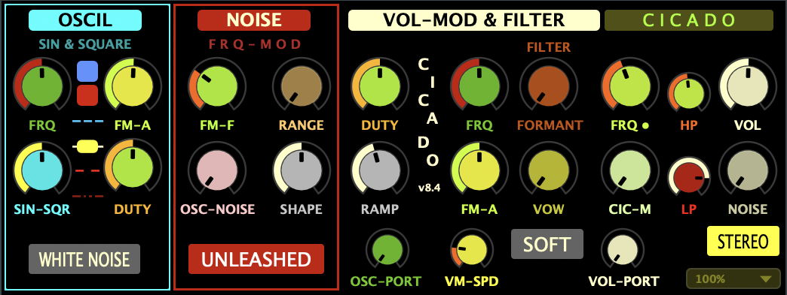

[← Back to Instrument Index](../index.md)

# Cicado — Technical Documentation

## Introduction

**Cicado** is a real-time performance instrument built in **Csound** and **Cabbage**, designed around two independently modulated voices—one per stereo channel—linked by a shared base frequency. Each voice applies separate modulation to pitch and amplitude, creating continuously shifting stereo textures. Through waveform fusion, spectral shaping, and layered stochastic processes, Cicado generates a broad and expressive range of timbral variation from a compact synthesis architecture.

Instead of layering multiple voices, Cicado shapes a single pitch stream through modulation and filtering. It is used as a **VST/AU plugin** in live performance contexts, designed for play without screen interaction. All parameters are accessible via **MIDI and OSC**, mapped to physical controls or touch interfaces such as Open Stage Control. Cicado functions both as a standalone voice and as an **ornamental counterpart** to harmonic instruments like [**Tokolo**](tokolo.md) and [**Bonkolo**](bonkolo.md), particularly in free, ensemble-based improvisation.

Inspired by the collective sound behaviors of cicadas, Cicado generates phase-shifting pulses, asynchronous rhythms, and timbral motion across the stereo field. Its architecture supports fluid transitions between noise, tone, and vocal-like coloration, all shaped through continuous control. The instrument responds directly to performance gestures, with a focus on **tactile responsiveness**, and all modulation parameters accessible via foot pedals, sliders, and touch interfaces.

  
   
  <em><strong>Cicado interface</strong>, showing grouped controls for oscillator shaping, frequency and amplitude modulation, formant filtering, stereo behavior, and output shaping. All parameters are mapped to MIDI/OSC controllers.</em>

## Sound Generation and Modulation

Cicado’s synthesis engine is built around waveform fusion, stochastic frequency and amplitude modulation, and dynamic vowel-based filtering—applied independently to each stereo channel. While controls are unified, each side of the signal path receives separate modulation, resulting in stereo divergence, drifting phase relationships, and spatial texture. All synthesis paths are designed to avoid aliasing, ensuring smooth, analog-like behavior even under extreme modulation.

### Oscillator and Frequency Control

The primary pitch is set using the **FRQ** dial and adjusted in octaves via dedicated **OCTAVE** controls (slider or momentary up/down buttons). Each stereo channel uses its own oscillator path, with common controls for stochastic modulation.

The primary waveforms are controlled by:

- **SIN-SQR**: Crossfades between a sine wave and a band-limited square waveform.
- **DUTY**: Controls the duty cycle of the square waveform, shaping its harmonic structure from rounded to bright, nasal, or buzzing.
- **WHITE NOISE**: Replaces the oscillator signal with a static band-limited noise source, bypassing waveform generation entirely.

### Stochastic Frequency Modulation

Each oscillator is modulated by a random spline that introduces continuous, organic pitch variation—ranging from subtle wobble to dense, shifting textures:

- **FM-A** sets the depth of modulation. At low values, it produces soft wobble or shimmer; at higher settings, it creates friction-like textures, fluttering detunings, or granular motion.
- **FM-F** sets the central frequency of the spline modulation. Low values produce slow, drifting motion; higher values approach audio-rate modulation.
- **RANGE** defines the bandwidth of the modulation. Larger values broaden the spread of frequencies, producing chirp-like sporadic behaviors with an element of unpredictability.
- **SHAPE** applies nonlinear shaping to the spline waveform: negative values use sinh-based compression to exaggerate transitions; positive values apply square-root flattening. Centered settings result in a smooth, unshaped waveform.

The **UNLEASHED** toggle controls how the modulation frequency range relates to pitch:

- In **LINKED** mode, both the central frequency and bandwidth of the spline modulation scale with oscillator pitch.
- In **UNLEASHED** mode, the spline frequency increases into the audio range, enabling it to function as a timbral modulator through fast pitch variation. When mixed into the signal via **OSC-NOISE**, it also becomes an audible source—producing broadband or noise-like textures depending on its rate and shape.

### Dual‑Layer Volume Modulation

Cicado’s volume modulation consists of two independent layers: a cyclic trapezoidal envelope (_Cicado effect_) and a downstream, noise-driven volume modulator that shapes the final output level.

#### The Cicado Effect

Amplitude modulation in Cicado is produced using a **trapezoidal waveform** per channel. The **CIC-M** slider acts as a dry/wet control for the amplitude modulation, crossfading between an unmodulated and fully modulated signal.

- **FRQ** sets the base modulation rate.
- **FRQ•** selects quantized frequency multipliers (1/4, 1/3, 1/2, 2/3, 1, 3/2, 2, 3), enabling polyrhythmic interplay with musicians.
- **DUTY** controls the plateau length of the trapezoid, shaping the proportion of each cycle spent at full volume—from short pulses to long holds.
- **RAMP** sets the rise and fall time of each modulation cycle. Short ramps produce sharp, hissing transients; longer ramps yield smooth breath-like articulations.

When **STEREO** mode is enabled, each channel uses a separately modulated envelope. This allows envelopes to drift in and out of phase, producing loosely interlocked or desynchronized patterns that evolve over time. This applies to other modulation sources as well: splines used for pitch and amplitude are independently generated per channel, resulting in stereo divergence even when using a shared control structure.

To introduce further temporal variation, the frequency of the amplitude modulator can itself be modulated using a second random spline:

- **VM-SPD** controls the speed of this second-order modulation.
- **FM-A** (in the **VOL-MOD & FILTER** section) controls the depth of the second-order modulation.

This second-order stochastic modulation creates envelopes that expand, contract, or slide unpredictably but smoothly—intensifying the de-phasing effect in stereo mode and producing non-repeating rhythmic articulation.

#### Noise‑Driven Master Volume Modulation

A separate **NOISE** control (beneath the **VOL** slider) modulates the final output volume by scaling it with the absolute value of the same random spline used for frequency modulation. This layer operates independently of the envelope and affects both channels equally. It introduces dynamic amplitude modulation, overlaid on top of the _Cicado effect_.

#### Volume Portamento and Tap-Based Control

Cicado supports **momentary foot-controlled volume taps**, allowing precise entrance and exit gestures shaped by adjustable portamento times.

- **VOL-PORT** sets the portamento time for volume changes triggered by taps.
- The **SOFT** toggle determines how portamento is applied:
  - When **SOFT** is **on**, the same portamento time applies to both volume increases and decreases.
  - When **SOFT** is **off**, portamento applies only to fade-outs; attacks remain immediate but gracefully smoothed, avoiding clicks or abrupt onset. This setting can mimic **reverb tails** while preserving articulation clarity.

These controls are particularly effective in cue-based or dynamically conducted ensemble contexts, where precise coordination of entrances and releases is essential.

### Formant Filtering and Vowel Shaping

Cicado includes two distinct formant filtering modes. Filtering is disabled at **FORMANT** = 0.

- At low **FORMANT** values, a three-band serial resonator with interpolated vowel shaping fades in gradually.
- At high values, the filter crossfades into a grain-based formant filter.

**VOW** continuously interpolates between stored formant profiles for vowels A, E, I, O, and U, affecting both formant frequency and bandwidth. This enables smooth transitions across vowel identities, rather than discrete switching. In combination with stochastic frequency and volume modulations, the vowel filter can sculpt evocative, attention-catching timbres or, with sharp envelopes, produce artifacts reminiscent of paper tearing or pebbles shifting.

### Global Tone Shaping

Cicado includes two post-processing filters—low-pass (**LP**) and high-pass (**HP**)—implemented as Butterworth filters.

- The **LP** filter, when mapped to a foot controller, offers tactile real-time expression and can serve as an alternative to the volume pedal.
- The **HP** filter is primarily used to remove low-frequency rumble, helping the instrument sit more cleanly in dense or resonant acoustic environments.

Together, these filters play an important role in adapting the instrument’s spectral balance to the acoustics of the room and the context of the ensemble.

## Control Integration: OSC, MIDI, and Pedals

Cicado is designed for hands-on performance. All parameters are accessible via **MIDI** or **OSC**, with typical control setups including:

- **Foot pedals** for volume modulation, mute taps, or filter control
- **XY pads and sliders** (e.g., via Open Stage Control) to manipulate paired parameters such as **FRQ** and **RANGE**
- **FRQ•** multiplier control via either a slider or radio buttons

## Use in Performance

Cicado is designed for real-time use in free improvisation and has been performed in a range of settings—from duets to small groups with a range of acoustic instruments, to larger ensembles and orchestras. Its flexible control system and responsive modulation architecture allow it to adapt to harmonic changes and ensemble dynamics—functioning as a flexible soloist, a textural layer, or a mood enhancer.

[← Back to Instrument Index](../index.md)
