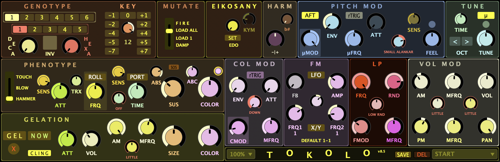

[← Back to Instrument Index](../index.md)

# Tokolo

## Introduction

**Tokolo** is a modular, polyphonic performance instrument developed in [Csound](https://csound.com/) and [Cabbage](https://cabbageaudio.com/), designed for expressive real-time improvisation. It supports dynamic tuning, per-note modulation, and acoustic-inspired articulation types, which define how notes are initiated and shaped. Control is intended to be entirely hands-on via MIDI controllers, foot pedals, or OSC-based tools, with no reliance on mouse interaction during performance. While **Tokolo** can respond to automation, its design prioritizes immediate, physical responsiveness.

The tuning system is based on **Erv Wilson’s Combination Product Sets (CPS)**, with selectable **Eikosany** scales and real-time modulation of their subsets—**Decanies** and **Hexanies**. **Church modes** in both **Just Intonation** and **Equal Division of the Octave (EDO)** provide additional modal frameworks, expanding the instrument’s tonal vocabulary.

Timbre is generated using **FM synthesis** and shaped through dynamic modulation of pitch, brightness, amplitude, and spatial behavior at the level of each note. These modulations are independently applied per voice using waveform-based envelopes and random generators, resulting in dynamic, evolving textures.

The instrument’s architecture has been refined through an iterative process involving performance, recording, and mixing, allowing its design to evolve directly through real-world musical use. It is structured for stability and fluency under live conditions, and all parameters are mapped to widgets intended for external control.

## Interface Structure

  
   
  <em>Tokolo interface, organized by functional groups: Genotype (mode and key selection), Mutate (response to tuning), Eikosany (scale selection), Pitch Modulation & Tuning, Phenotype (articulation type), Gelation (sustained evolving layer), Color Modulation (timbre), FM Synthesis, Lowpass Filter, and Volume & Pan modulation. Key parameters are mapped to MIDI/OSC controllers.</em>

The signal architecture is organized as a layered real-time processing system. Incoming MIDI notes are routed through a tuning and mapping layer, which selects pitches from a dynamically indexed scale table. Each note’s behavior is determined by the articulation type. These articulated notes trigger an FM synthesis engine, where each note is rendered using a fixed carrier-modulator structure with adjustable ratios, depths, and feedback. Per-note modulation is applied to pitch, FM depth (color), volume, and panning. Finally, all audio is summed and passed through a global lowpass filter before output.

_Signal Flow Overview:_  
MIDI Input → Genotype & Tuning → Phenotype → Pitch & Color Mod → FM Synthesis → Volume & Pan Mod → LP Filter → Output

The interface is divided into clearly labeled regions:

- **Genotype**: controls scale selection and key transposition
- **Phenotype**: defines articulation type (**TOUCH**, **BLOW**, **HAMMER**) with sustain control (**SUS**) and portamento toggle (**PORT**)
- **Mutate**: sets how active notes respond to tuning changes (**FIRE**, **LOAD ALL**, **LOAD 1**, **DAMP**)
- **Gelation**: enables frozen note layering via the **GEL** toggle, with additional control over freezing and accumulation using **NOW**, **CLING**, and **SIZE**
- **Roll**: enables pressure-controlled note retriggering, emulating repeated strokes on instruments like the cimbalom
- **Pitch Modulation**: applies pitch variation using periodic or stochastic sources shaped by dynamic envelopes
- **Color Modulation**: modulates FM depth independently per layer using stochastic or periodic signals
- **Volume and Panning Modulation**: applies dynamic amplitude shaping and stereo movement per note

## Roll Control

**Roll** is a pressure-sensitive retriggering mode inspired by repeated strokes on snare drums and stick-based string instruments like the cimbalom. When the **ROLL** toggle is enabled, held notes are retriggered continuously. **FRQ** sets the base repetition rate, while aftertouch dynamically modulates the roll speed—light pressure yields slow rolls, increased pressure produces faster repetition. This behavior is polyphonic and integrates smoothly with all articulation types.

## Tuning and Scale System

Tokolo supports multiple tuning systems centered on a unified addressing structure that maps MIDI input to dynamically selected pitch values. The primary framework is based on **Combination Product Sets (CPS)**, specifically **Eikosanies**, which are 20-note scales. During performance, the player can select among different Eikosany structures, though a more common musical workflow involves modulating between different **Hexanies** (6 note scales)—within a given **Decany** (10 note subsets of the active Eikosany). This structure provides a large space of harmonic variation, allowing performers to explore richly structured microtonal materials using a consistent and musically coherent system.

In addition to CPS-based tunings, Tokolo includes a set of **Church modes** in both **Just Intonation** (e.g., 7-limit, Centaura variants) and **Equal Division of the Octave (EDO)**. These tunings are available through the same interface and can be selected in real time. All tuning data is precomputed in **Python** and loaded into the instrument as frequency tables. A compound indexing system combines mode, key (transposition) and note selection, allowing pitch values to be retrieved efficiently from a unified table.

### Mutate Modes

When the tuning is changed during a performance, Tokolo offers several behaviors for handling currently sounding notes, referred to as **Mutate modes**:

- In **FIRE** mode, all active notes change pitch immediately to match the new tuning.
- In **LOAD ALL** mode, existing notes keep their current pitch until a new note is played, at which point all update together.
- In **LOAD 1** mode, new notes adopt the new tuning while existing ones remain unchanged; re-pressing the same key will trigger a new note with the updated pitch.
- In **DAMP** mode, all existing notes are released (damped) when the tuning is changed.

This mechanism allows performers to navigate tuning changes either smoothly or sharply, depending on musical context. In practice, **LOAD ALL** is often used to change the harmonic structure in a way that allows previously sustained notes to follow the next played note, supporting the melodic line.

The mapping from MIDI keys to note indices is handled separately through a dynamic keymap (via the **KYM** control), enabling flexible and ergonomic keyboard layouts that can be reconfigured in real-time to suit different performance contexts or physical controllers.

Additional performance-level tuning controls include a **TUNE** slider, which adjusts the global tuning offset. The **µ** toggle enables higher tuning resolution. A reset button quickly returns the tuning to its default state. An **OCTAVE** control is also available, allowing full-range octave shifts via MIDI input. Like other performance gestures (e.g., **NOW**, **MELT**), it is ergonomically mapped for seamless use during live performance.

Additional harmonic shaping is provided by the **HARM** control, which introduces probabilistic harmonization. When centered, it is inactive; moving the slider left or right increases the likelihood of additional harmonic notes being triggered. The **b#** control determines the transposition of those added notes—leftward positions shift them downward (flats), rightward positions upward (sharps), with center maintaining unison.

### Phenotype (Articulation Types)

Tokolo offers several articulation types that define how notes are initiated, shaped, and sustained, referred to as **Phenotype**. These types fundamentally alter the mechanics of the instrument, in ways analogous to how acoustic instruments differ, such as a piano versus a wind instrument. The articulation type determines the envelope behavior, responsiveness to pressure (aftertouch), and in some cases, the attack or sustain of each note. These modes can be used in either polyphonic or monophonic (**portamento**) configurations.

- **TOUCH** triggers a short envelope on key press, with no sustain phase. Aftertouch controls volume, allowing fast, pressure-sensitive phrasing with immediate response and precise dynamic control.
- **BLOW** introduces inertia to the onset curve, mimicking instruments where airflow or breath pressure shapes the attack, such as harmoniums or pipe organs. It combines an adjustable sustain (**SUS**) with continuous aftertouch, allowing gradual shaping of each note’s intensity—even after the note has started.
- **HAMMER** behaves like a struck instrument. Key velocity defines attack intensity, and the sustain pedal (**SUS**) determines the amount of note damping. This articulation supports dynamic phrasing, layered polyphony, and traditional piano-like behavior but adds a continuous damping control.

Each articulation type can operate in polyphonic or monophonic (**portamento**) mode. When portamento is enabled via the **PORT** button, new notes glide from the previous one with an adjustable glide time.

Additional shaping for bass notes is provided by the **ABS** and **ABC** toggles. ABS (Attenuated Bass Sustain) shortens envelopes for low notes to avoid muddiness, while ABC (Amplified Bass Color) boosts FM modulation depth in the same range to enhance presence. These adjustments are applied automatically based on note pitch using lookup tables and contribute to the instrument’s controlled low-end response. A separate **TRX** control sharpens note onsets by emphasizing initial transients independently of articulation type.

### Gel Mode and Layering

**Gel mode** allows notes to be sustained indefinitely while remaining dynamically modulated. Unlike a freeze pedal, frozen notes retain per-note modulation of volume, timbre, and pan, keeping them expressive and responsive even after their initial trigger. Gel mode includes dedicated modulation controls, along with a separate volume control to adjust the balance between the frozen and active performance layers.

When **GEL** is toggled ON, all newly played notes are frozen. When **GEL** is OFF, pressing **NOW** freezes the currently held notes. If the **CLING** toggle is OFF, all previously frozen notes are replaced by the new selection when **NOW** is pressed. The **X** button clears all frozen notes. These tools allow flexible layering and transformation of sustained material without interrupting performance flow.

The maximum number of active voices in Gel mode is limited by the **SIZE** parameter. When new notes are added beyond this limit, older ones are faded out gradually. Reducing the **SIZE** value manually will also trim the frozen layer.

## FM Synthesis

Tokolo’s sound engine is based on a fixed FM topology consisting of a carrier oscillator modulated by two stacked modulators. The timbral character is shaped by the **COLOR** and **AMP** parameters, which control the modulation depth from each modulator. By adjusting these depths together with the modulator frequency ratios, the instrument can produce a wide range of sonic identities—from bell-like and metallic tones to reed-like, organ-inspired, or synthetic and detuned textures. This range is captured in a set of curated presets, which provide immediate access to useful and contrasting FM configurations.

#### Controls (FM section):

- **COLOR** – Sets the modulation depth from modulator 1 to the carrier
- **AMP** – Sets the modulation depth from modulator 2 to modulator 1
- **FB** – Sets feedback depth on modulator 2. Feedback is dynamically scaled by **COLOR** and has no effect when COLOR is zero
- **FRQ1** – Sets the frequency ratio of modulator 1 relative to the carrier
- **FRQ2** – Sets the frequency ratio of modulator 2 relative to modulator 1
- **X/Y** – Toggles between discrete (rational) and continuous (floating point) selection for modulator frequency ratios
- **FMPreset** – Instantly changes the active FM configuration

## Expressive Modulation

Tokolo supports per-note modulation of **pitch**, **color** (FM depth), **volume**, and **pan**. Each modulation target includes adjustable parameters for waveform type, frequency, amplitude and modulation fade behavior. The control interface is designed for live use, including multifunctional sliders that combine different modulation parameters in a single gesture. A set of preset buttons in each section enables fast switching between modulation profiles.

### Pitch Modulation

Inspired by the melodic ornamentation techniques used in Indian classical music (**Alankars**), Tokolo’s pitch modulation system allows notes to drift between stability and modulation, using periodic (e.g. vibrato-like) or stochastic (e.g. jittered, random) motion with full control over behavior and timing.

#### Controls (PitchMod section):

- **µMOD** – Sets modulation type and depth. Left of center selects periodic waveforms; right of center selects stochastic waveforms. Distance from center determines depth.
- **µFRQ** – Modulation frequency.
- **ENV** – Envelope direction and amount. Center applies no envelope. Left/Right of center creates a fade out/in of modulation. Distance from center sets the strength of the fade.
- **ATT** – Envelope duration (attack time).
- **rTRIG** – When enabled, modulation envelopes are retriggered on tuning changes in **mutate** modes.
- **PitchPreset** – Instantly changes the active pitch modulation preset.
- **FEEL** – Emulates pitch wheel behavior by applying a real-time offset to modulation frequency.
- **SENS** – Adjusts how strongly aftertouch affects modulation intensity.
- **Reset FEEL** – Resets the FEEL slider to its neutral (center) position.

### Color Modulation

Color modulation shapes the FM depth—the amplitude of the modulator signal—and is central to Tokolo’s timbral character. By adjusting this depth dynamically, the instrument can shift between distinct sonic identities, such as bell-like strikes, smooth organ tones, or more unstable, noise-like textures. Modulation can be periodic or stochastic, producing anything from subtle shimmer to complex spectral movement. **Gel** and non-Gel layers have separate **COLOR** (FM depth) controls, which scale the amount of modulation applied.

#### Controls (ColorMod section):

- **CMOD** – Amount of stochastic modulation.
- **MFRQ** – Modulation frequency.
- **ENV** – Envelope direction and amount. Center applies no envelope. Left/Right of center creates a fade out/in of modulation. Distance from center sets the strength of the fade.
- **ATT** – Envelope duration (attack time).
- **rTRIG** – When enabled, color modulation envelopes are retriggered on tuning changes in **mutate** modes.
- **TimbreModPreset** – Instantly changes the active color modulation preset.

### Volume Modulation

Volume modulation introduces dynamic amplitude variation, such as tremolo or random fluctuations. Modulation can be periodic or stochastic and is scaled by independent volume levels for **Gel** and non-Gel layers.

#### Controls (Volume Modulation section):

- **MOD** – Sets modulation type and depth. Left of center selects periodic waveforms; right of center selects stochastic waveforms. Distance from center determines depth.
- **FRQ** – Modulation frequency.
- **VolumeModPreset** – Instantly changes the active volume modulation preset.

### Pan Modulation

Each note is assigned a pan position based on pitch. The stereo field can be narrowed to mono or expanded for maximum spread. As modulation increases, note positions become dynamic, moving independently based on periodic or stochastic variation.

#### Controls (Pan Modulation section):

- **MOD** – Sets modulation type and depth. Left/Right of center selects periodic/stochastic movement; distance from center determines depth.
- **FRQ** – Modulation frequency.
- **PanModPreset** – Instantly changes the active pan modulation preset.

## Lowpass Filter

Tokolo includes a global Moog-style lowpass filter applied after all per-note processing. It can be used either statically or as a dynamic spectral shaper ranging from classic periodic wah-wah sweeps to stochastic modulations.

#### Controls (LP Filter section):

- **FRQ** – Base cutoff frequency of the filter.
- **FMOD** – Modulation depth. Controls how much the cutoff frequency varies over time.
- **MFRQ** – Modulation rate. Controls how fast the cutoff frequency changes.
- **RND** – Blends randomness into the modulation. At 0: fully periodic. At 1: fully stochastic.
- **LPpreset** – Instantly changes the active lowpass filter modulation preset.

In addition to the user-controlled filter, a separate global equalization stage is applied post-synthesis to compensate for perceptual imbalances. This EQ is based on a custom auditory tuning inspired by Fletcher–Munson curves and attenuates harshness in the upper mids while reinforcing low-end presence. It is implemented as a fixed series of band filters and is not user-adjustable.

[← Back to Instrument Index](../index.md)
